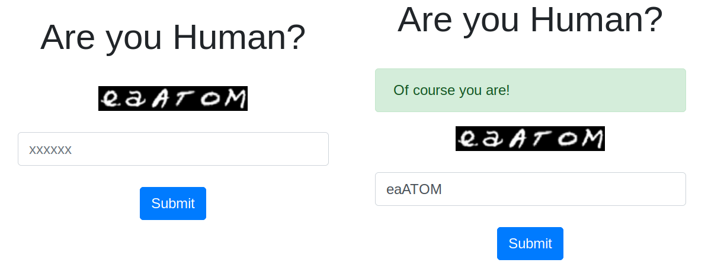
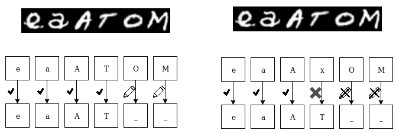

# DrCaptcha
    
  DrCaptcha is an interactive machine learning application. The purpose of the program is to the feedback provided by users, and to use it to optimize a machine learning model. The purpose of this model is to recognize handwritten letters and numbers.

## Methodology
DrCaptcha initially provides users with a CAPTCHA. Then the system compares the values given by the user to the values stored for the captcha. If these values match then the system recognizes that the user is a human, otherwise not. 

The difference between this system and the classic captcha systems is that the system itself, for some of the images, does not know the labels. In the example of the figure below, the system may have labels for the characters e, a, A, and T, while it does not have characters O and M.

When the system verifies that the user input matches the data in the database, then it will take the user's input ​​for the non-classified characters, and will classify them according to the values ​​given by the user. In the case where the user input is incorrect, the system will not proceed to character classification. In this way, the user provides implicit feedback to the system by classifying characters, which will later be used to train machine learning models. With the classified characters, the application trains some artificial neural networks.

When we finish training neural networks, an administrator can create an ensemble of neural networks and assign weights to them. This whole acts as a meta-model that takes the predictions from the models that make it up and then decides based on what prediction to give as a result. When the user creates or makes a change to this ensemble, the application evaluates and stores its parameters. 

## Setup (Ubuntu 18.04)
    git clone https://gitlab.com/rafaelglikis/drcaptcha.git && cd drcaptcha
    apt install graphviz python3-tk
    pip3 install -r requirements.txt
    
### Run Migrations

    ./manage.py migrate
    ./manage.py createsuperuser
        
## Import and Generate data Data

    ./manage.py importemnist
    ./manage.py removelabels <count>
    ./manage.py generatecaptchas <count>
        
## Train neural network

    ./manage.py train

### Setup (Docker) 
    git clone https://gitlab.com/rafaelglikis/drcaptcha.git && cd drcaptcha
    docker build -t drcaptcha .    
    # Run this only if you have nvidia gpu with compute capability 3.5 or higher
    docker build -t drcaptcha-gpu -f Dockerfile.gpu .

#### Run Commands
You can run a django command (manage.py) using docker-manage.sh script. For example if you want to run the django server you should run:
    
    ./docker-manage.sh runserver 0.0.0.0:8000

Create Database:

    ./docker-manage.sh migrate
    ./docker-manage.sh createsuperuser

Import and Generate data Data:
    
     ./docker-manage.sh importemnist
     ./docker-manage.sh removelabels <count>
     ./docker-manage.sh generatecaptchas <count>
     
Train neural networks

    ./docker-manage.sh train

or
    
    ./docker-gpu-train.sh

